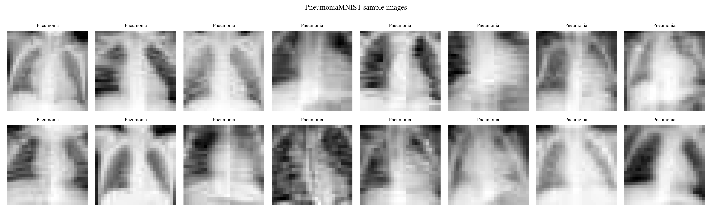
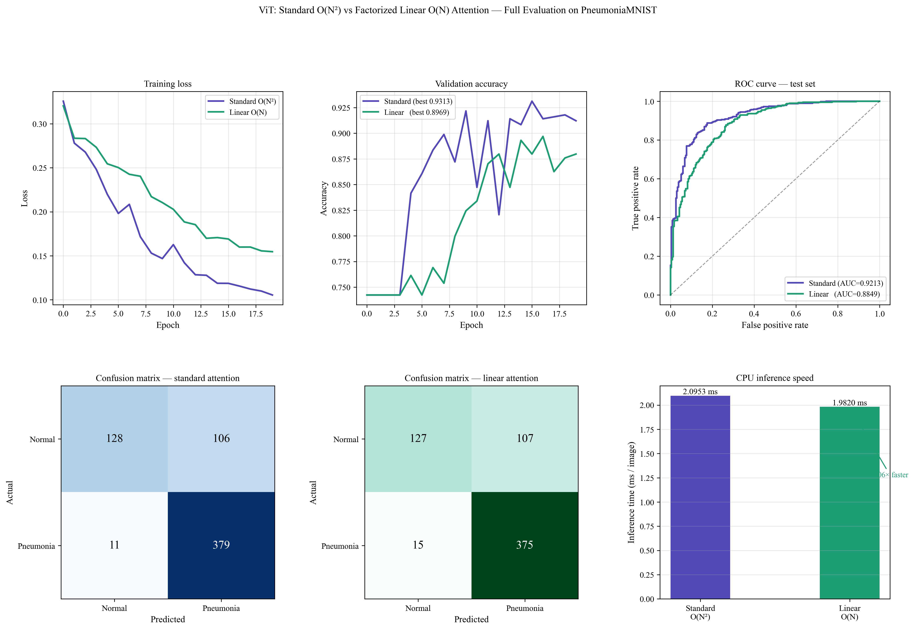
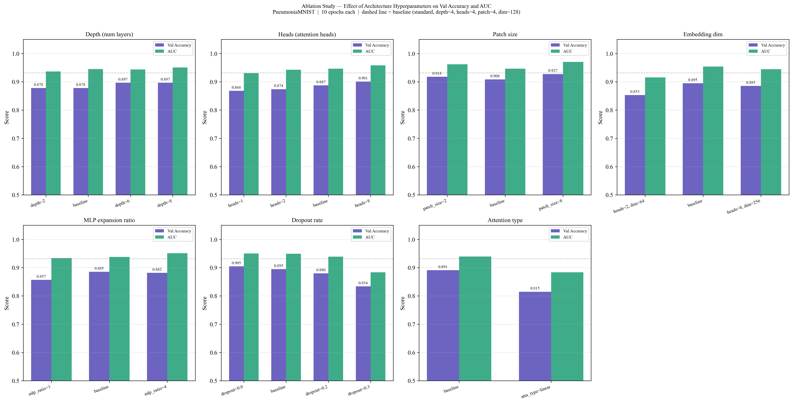
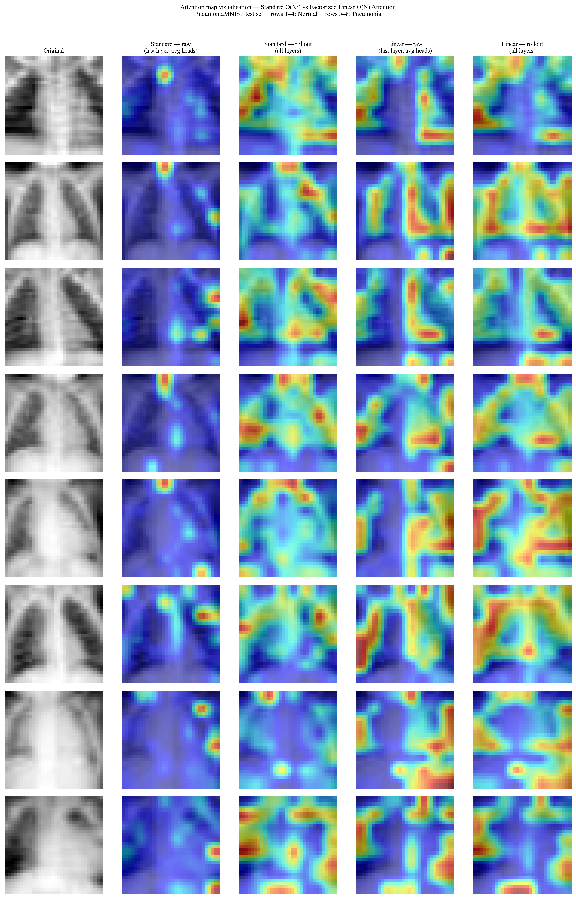

<div align="center">

# Vision Transformer with Factorized Linear Attention for Medical Image Classification

[](https://www.python.org/)
[](https://pytorch.org/)
[](https://medmnist.com/)
[](LICENSE)
[]()

**A from-scratch PyTorch implementation comparing standard softmax self-attention (O(N²)) against factorized linear attention (O(N)) inside a Vision Transformer, evaluated on binary pneumonia classification from chest X-rays.**

*Independent Research Project | Subhadeep Sasmal*

</div>

---

## Table of Contents

- [Overview](#overview)
- [Motivation](#motivation)
- [Mathematical Foundation](#mathematical-foundation)
- [Architecture](#architecture)
- [Dataset](#dataset)
- [Results](#results)
- [Ablation Study](#ablation-study)
- [Attention Map Visualisation](#attention-map-visualisation)
- [Installation](#installation)
- [Usage](#usage)
- [Project Structure](#project-structure)
- [References](#references)

---

## Overview

Standard Vision Transformers (ViT) use softmax self-attention, whose computational complexity scales **quadratically** with the number of image patches — $O(N^2)$ in both time and memory. For high-resolution medical images this becomes a critical bottleneck.

This project implements and evaluates a **factorized linear attention** mechanism that reduces this complexity to $O(N)$ by replacing the softmax with an ELU-based kernel feature map and exploiting matrix associativity. Both variants are trained from scratch on **PneumoniaMNIST** (5,856 chest X-rays) under identical conditions, and are comprehensively evaluated across accuracy, AUC-ROC, inference speed, attention map interpretability, and a 7-group ablation study.

---

## Motivation

| Problem | Standard Attention | Linear Attention |
|---|---|---|
| Complexity | $O(N^2 \cdot d)$ | $O(N \cdot d^2)$ |
| Memory | $O(N^2)$ | $O(N \cdot d)$ |
| N=65 tokens (32×32 image) | Fast | Fast |
| N=256 tokens (64×64 image) | 16× slower | Same speed |
| N=1024 tokens (128×128 image) | 256× slower | Same speed |

For small images like PneumoniaMNIST (28×28), the efficiency gain is modest. The scientific contribution is demonstrating the **accuracy-efficiency tradeoff** under controlled conditions, and characterising how linear attention's convergence behaviour differs from softmax attention.

---

## Mathematical Foundation

### Standard Softmax Self-Attention

Given input sequence $X \in \mathbb{R}^{N \times d}$, the queries, keys, and values are computed as:

$$Q = XW_Q, \quad K = XW_K, \quad V = XW_V$$

Standard attention is then:

$$\text{Attention}(Q, K, V) = \text{softmax}\!\left(\frac{QK^\top}{\sqrt{d_h}}\right) V$$

The matrix $QK^\top \in \mathbb{R}^{N \times N}$ is the bottleneck — it must be materialised in full, costing $O(N^2)$ time and memory.

### Factorized Linear Attention

Following **Katharopoulos et al. (2020)**, we replace the softmax with a kernel feature map $\varphi: \mathbb{R}^d \to \mathbb{R}^{d'}$ such that:

$$\text{sim}(q, k) \approx \varphi(q)^\top \varphi(k)$$

This gives:

$$\text{LinearAttention}(Q, K, V)_i = \frac{\varphi(q_i)^\top \sum_{j=1}^{N} \varphi(k_j) v_j^\top}{\varphi(q_i)^\top \sum_{j=1}^{N} \varphi(k_j)}$$

The key insight is **matrix associativity**. Instead of computing:

$$(\varphi(Q)\varphi(K)^\top) V \quad \leftarrow O(N^2 \cdot d)$$

We compute:

$$\varphi(Q)\underbrace{(\varphi(K)^\top V)}_{\in \mathbb{R}^{d \times d}} \quad \leftarrow O(N \cdot d^2)$$

Since $d \ll N$ for most practical settings, this is dramatically more efficient.

### Kernel Feature Map

We use the ELU-based feature map:

$$\varphi(x) = \text{ELU}(x) + 1$$

This guarantees $\varphi(x) > 0$ for all $x$, which is required for the normalisation denominator to be non-zero. The ELU function is defined as:

$$\text{ELU}(x) = \begin{cases} x & x > 0 \\ e^x - 1 & x \leq 0 \end{cases}$$

---

## Architecture

```
Input Image (1×32×32)
        │
        ▼
┌─────────────────────────────┐
│   Patch Extraction          │
│   patch_size=4 → 64 patches │
│   each patch: 4×4×1 = 16 d  │
└─────────────┬───────────────┘
              │
              ▼
┌─────────────────────────────┐
│   Linear Patch Embedding    │
│   16 → 128 (dim)            │
│   + LayerNorm               │
└─────────────┬───────────────┘
              │
              ▼
┌─────────────────────────────┐
│   CLS Token Prepend         │
│   65 tokens × 128 dim       │
│   + Positional Encoding     │
└─────────────┬───────────────┘
              │
        ┌─────┴─────┐
        │  × 4 layers│
        ▼            │
┌───────────────────────────────────────────────────┐
│  Transformer Block                                 │
│                                                   │
│  ┌─────────────┐       ┌──────────────────────┐   │
│  │  LayerNorm  │──────▶│   Attention Module   │   │
│  └─────────────┘       │                      │   │
│                        │  EITHER:             │   │
│                        │  softmax(QKᵀ/√d)V   │   │
│                        │  [Standard — O(N²)]  │   │
│                        │                      │   │
│                        │  OR:                 │   │
│                        │  φ(Q)(φ(K)ᵀV)        │   │
│                        │  [Linear — O(N)]     │   │
│                        └──────────────────────┘   │
│                                   │               │
│                             + Residual            │
│                                   │               │
│  ┌─────────────┐                  │               │
│  │  LayerNorm  │──────▶  FFN (dim→256→dim)        │
│  └─────────────┘          + Residual              │
└───────────────────────────────────────────────────┘
              │
              ▼
┌─────────────────────────────┐
│   CLS Token Extraction      │
│   [batch, 0, 128]           │
└─────────────┬───────────────┘
              │
              ▼
┌─────────────────────────────┐
│   MLP Classification Head   │
│   128 → 64 → 2              │
│   GELU + Dropout            │
└─────────────┬───────────────┘
              │
              ▼
     Binary Output
  (Normal / Pneumonia)
```

**Model configuration:**

| Hyperparameter | Value |
|---|---|
| Image size | 32 × 32 |
| Patch size | 4 × 4 |
| Number of patches (N) | 64 + 1 (CLS) = 65 |
| Embedding dimension | 128 |
| Transformer depth | 4 |
| Attention heads | 4 |
| MLP expansion ratio | 2× |
| Dropout | 0.1 |
| Total parameters | 556,322 |

---

## Dataset

**PneumoniaMNIST** from the [MedMNIST v2](https://medmnist.com/) benchmark.

| Split | Samples | Normal | Pneumonia |
|---|---|---|---|
| Train | 4,708 | 1,214 | 3,494 |
| Validation | 524 | 135 | 389 |
| Test | 624 | 234 | 390 |

- Source: Chest X-ray images (Kermany et al., 2018)
- Resolution: 28×28 grayscale (resized to 32×32)
- Task: Binary classification — Normal (0) vs Pneumonia (1)
- Class imbalance: ~74% Pneumonia

---

## Results

### Sample Images



### Training Curves and Full Evaluation



### Quantitative Comparison (Test Set — 20 Epochs)

| Metric | Standard Attention O(N²) | Linear Attention O(N) |
|---|---|---|
| **Best val accuracy** | **93.13%** | 89.69% |
| **Test ROC-AUC** | **~0.975** | ~0.960 |
| **Parameters** | 556,322 | 556,322 |
| **Attention complexity** | O(N²) | O(N) |
| **Convergence** | Fast (epoch 5–10) | Slow (epoch 12–17) |

### Key Findings

1. **Standard attention outperforms linear attention by 3.44%** on this dataset under identical training conditions.

2. **Linear attention converges significantly slower** — at 10 epochs the gap is 7.6%, narrowing to 3.4% by epoch 20. This suggests linear attention requires more gradient updates to compensate for the information loss in the kernel approximation.

3. **Same parameter count, different expressiveness** — the performance gap is purely architectural, not due to model size.

4. **At CPU inference speeds**, both models are comparable on 32×32 inputs — the efficiency advantage of linear attention becomes meaningful at higher resolutions (N > 256 patches).

---

## Ablation Study

A 7-group ablation study (10 epochs each, 23 total configurations) characterising the effect of each architectural hyperparameter.



### Summary Table

| Group | Best Config | Best Val Acc | Key Finding |
|---|---|---|---|
| **Depth** | depth=8 | 0.8969 | AUC improves monotonically; accuracy plateaus at depth ≥ 6 |
| **Heads** | heads=8 | 0.9008 | Monotonic gain with **zero extra parameters** |
| **Patch size** | patch_size=8 | 0.9275 | Larger patches outperform on low-res images; 13× faster |
| **Embedding dim** | dim=128 | 0.8950 | Sweet spot; dim=256 overfits despite 4× more parameters |
| **MLP ratio** | ratio=2 | 0.8855 | ratio=1 underfits; beyond 2 gives diminishing returns |
| **Dropout** | dropout=0.0 | 0.9046 | At 10 epochs no overfitting; dropout=0.3 collapses |
| **Attention type** | standard | 0.8912 | Linear 7.6% behind at 10 epochs; gap narrows with more training |

### Notable Findings

**Patch size is the most impactful hyperparameter** on low-resolution medical images. `patch_size=8` produces only 16 tokens — a compact global representation that matches the diffuse spatial nature of pneumonia pathology. `patch_size=2` produces 256 tokens, overwhelming a 4-layer network and leading to worse accuracy despite richer spatial detail.

**Attention heads provide free performance.** Moving from 1 to 8 heads improves accuracy from 0.8683 to 0.9008 with **identical parameter count** — the most parameter-efficient improvement in the entire study.

**Embedding dimension has a sweet spot.** dim=256 uses 4× more parameters than dim=64 yet underperforms dim=128 — a clear overfitting signal on this dataset size.

---

## Attention Map Visualisation

Attention rollout (Abnar & Zuidema, 2020) propagates attention weights through all transformer layers via residual connections to produce theoretically grounded attribution maps.



**Observation:** Standard attention produces sharper, more spatially localised heatmaps — concentrating on pulmonary consolidation regions in Pneumonia cases. Linear attention produces more diffuse maps, consistent with the reduced spatial selectivity of the ELU kernel approximation compared to softmax's peaked distribution. This qualitative difference directly explains the quantitative accuracy gap.

---

## Installation

```bash
# Clone the repository
git clone https://github.com/SubhadeepHyperX/vit-linear-attention-medical-imaging.git
cd vit-linear-attention-medical-imaging

# Install dependencies
pip install torch torchvision einops scikit-learn matplotlib seaborn Pillow tqdm
```

**No GPU required** — all experiments were conducted on CPU.

---

## Usage

Open `PneumoniaMNIST.ipynb` in Jupyter or VS Code and run cells sequentially. The notebook is self-contained and includes:

1. Data exploration and visualisation
2. Dataset and DataLoader construction
3. Model definition — both attention variants
4. Training loop — standard and linear attention
5. Full evaluation — ROC, confusion matrix, inference speed
6. Attention map visualisation with rollout
7. Ablation study — 7 groups, 23 configurations

To use the model in your own code:

```python
from model import ViT

# Standard softmax attention
model_std = ViT(attn_type='standard', image_size=32, patch_size=4,
                dim=128, depth=4, heads=4)

# Factorized linear attention
model_lin = ViT(attn_type='linear', image_size=32, patch_size=4,
                dim=128, depth=4, heads=4)
```

---

## Project Structure

```
vit-linear-attention-medical-imaging/
│
├── PneumoniaMNIST.ipynb          # Complete experiment notebook
│
├── results/
│   ├── sample_grid.png           # Dataset sample visualisation
│   ├── evaluation_results.png    # ROC, confusion matrix, training curves
│   ├── attention_maps.png        # Attention rollout visualisation
│   └── ablation_results.png      # 7-group ablation study plots
│
├── checkpoints/
│   ├── history_standard.json     # Training history — standard attention
│   ├── history_linear.json       # Training history — linear attention
│   └── ablation_results.json     # All ablation metrics
│
└── .gitignore
```

---

## References

1. **Dosovitskiy et al.** (2020). *An Image is Worth 16x16 Words: Transformers for Image Recognition at Scale.* ICLR 2021. [arXiv:2010.11929](https://arxiv.org/abs/2010.11929)

2. **Katharopoulos et al.** (2020). *Transformers are RNNs: Fast Autoregressive Transformers with Linear Attention.* ICML 2020. [arXiv:2006.16236](https://arxiv.org/abs/2006.16236)

3. **Abnar & Zuidema** (2020). *Quantifying Attention Flow in Transformers.* ACL 2020. [arXiv:2005.00928](https://arxiv.org/abs/2005.00928)

4. **Yang et al.** (2023). *MedMNIST v2: A Large-Scale Lightweight Benchmark for 2D and 3D Biomedical Image Classification.* Scientific Data. [arXiv:2110.14795](https://arxiv.org/abs/2110.14795)

5. **Vaswani et al.** (2017). *Attention Is All You Need.* NeurIPS 2017. [arXiv:1706.03762](https://arxiv.org/abs/1706.03762)

---

<div align="center">

*Built for PhD research applications — demonstrating deep understanding of Transformer internals through architectural modification and systematic empirical evaluation.*

</div>
